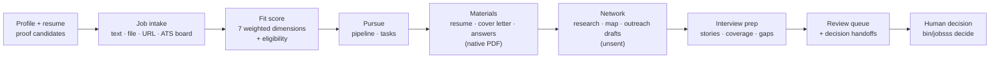

<div align="center">

# JobSSS

**An independent Agent Plugin that gives your agent a local, evidence-grounded job-search workspace.**

`Agent Plugins 1.0.0` · `v0.1.0` · `MIT` · `Node 22+` · `zero npm dependencies` · `zero API keys`

</div>

---

> **JobSSS is a standalone Agent Plugin, not a component of another product.**
> It ships one skill and one bundled MCP runtime. At runtime it never resolves,
> imports, or spawns JobOS or any other project — no JobOS installation, no
> `jobos` on `PATH`, no API key, no account. The network is optional and used
> only for public job intake. Some proven behavior was ported from MIT-licensed
> JobOS early on and is attributed in [LICENSE](LICENSE); that attribution is a
> provenance note, not a dependency.

## What it is

JobSSS is a job-search **workspace for agents**: the host agent gets 47 local MCP
tools for the whole search loop, and every result lands as durable, inspectable
state under one host-provided data directory (`PLUGIN_DATA`).

Concretely, JobSSS will:

- **Build a profile from a resume** (inline text or a staged file) and extract
  proof-point *candidates* that a human verifies — never auto-verified.
- **Take jobs in** from pasted text, a staged file, a public job URL, or a public
  ATS board (Greenhouse board tokens), then **deduplicate** identical postings to
  one job id.
- **Score fit deterministically** across seven weighted dimensions with explicit
  evidence, reasons, and fail-closed eligibility — no model call, no provider.
- **Run the local pipeline**: pursue, readiness plans, tasks, save/skip/archive,
  review queue.
- **Write applicant materials** — tailored resume, cover letter, reusable answers
  — grounded in owned proof, including **native searchable PDF bytes** written
  under `PLUGIN_DATA` with no browser or converter.
- **Map your network locally**, plan outreach, and draft outreach as **UNSENT**.
- **Prepare interviews**: STAR story drafts, question coverage, gaps, and a
  non-attesting debrief handoff.
- **Hand decisions to a human** on a trusted local CLI, with exact id, revision,
  and content hash.

And it will never: send an email, submit an application, attest `applied`, approve
an artifact, verify an interview story, schedule anything, or drive a browser.
Those actions are either blocked or completed by a human on the trusted local
surface. JobSSS does not fabricate jobs, scores, proofs, or success.

## Architecture

<p align="center">
  
</p>

Diagram source: [`docs/jobsss-architecture.mmd`](docs/jobsss-architecture.mmd).

Five boundaries carry the whole design:

1. **The host never touches state.** It reads the skill and calls tools; the MCP
   layer validates JSON-RPC envelopes before dispatch, so the agent cannot reach
   past the tool contract.
2. **The plugin is self-contained.** One launcher, one MCP server, one domain
   layer. It resolves nothing from outside itself — no other project, no service.
3. **`PLUGIN_DATA` is the only state root.** Durable state, exports, and the audit
   trail live there; the plugin directory stays read-only and portable.
4. **Network access is one narrow pipe.** Bounded, public-address-only intake of
   job pages and public ATS boards. Everything else is blocked.
5. **Human authority never travels through MCP.** `list_decision_handoffs` and
   `create_decision_handoff` create non-authoritative markers only; a human
   completes the decision on `./bin/jobsss decide`.

### What it does, end to end



## Features

### Local-first core

| Feature | What you get |
| --- | --- |
| **Zero-dependency runtime** | Node 22+ standard library only. No npm install, no bundler, no browser, no system converter, no font installation. |
| **Offline by default** | The entire core journey (doctor → start → profile → intake → score → pursue → pipeline → review) runs with no network, no API key, and no provider. Network is used only for optional public intake. |
| **One data root** | All durable state lives under `PLUGIN_DATA`. Nothing is written into the plugin directory, and no user state leaks into the repository. |
| **Restart-safe** | Versioned store with lossless migration from the legacy `store.json`, plus read-only restart readbacks (`get_resume`, `get_score`, `get_interview_prep`). |
| **Readable state** | Canonical `store.json` plus JSON projections and a Markdown `audit.md` mirror so humans and agents can inspect state without a running service. |

### Profile, resume and proof

| Feature | What you get |
| --- | --- |
| **Profile creation + import** | `create_profile` takes a name plus inline resume text or a staged file under `PLUGIN_DATA`. |
| **Proof-point extraction** | Resume imports extract proof *candidates* with metrics, always flagged for human verification. Retrying an identical proof keeps the original record and its verification; changed summary/skills/metrics create a separate unverified proof while preserving prior evidence. |
| **Structured resume revisions** | Versioned resume revisions per profile, inspectable via `list_resumes`, read back in full via `get_resume`. |
| **Preference control** | `update_profile` changes preferences (target role families, skills, compensation floor, location/work model, mission) — a real preference revision flows into tailored output instead of being a formatting no-op. |
| **Identity safety** | Reimports resolve a unique exact current name (including after rename); conflicting renames and ambiguous imports are rejected rather than merged. |

### Job intake and discovery

| Feature | What you get |
| --- | --- |
| **Three intake paths** | Inline `text`/`content`, a staged path under `PLUGIN_DATA`, or a public `http(s)` URL. Arbitrary absolute filesystem paths are rejected (`unsafe_intake_path`). |
| **Public URL hardening** | `import_job_url` rejects `file:`, credentialed URLs, private/loopback/link-local hosts, single-label names, unsafe redirects, oversized and failed responses with typed errors. |
| **Public ATS intake** | Greenhouse boards by `boardToken`: listing + detail payloads, application questions with option sets, required document kinds, and raw provenance. |
| **Offline discovery path** | Staged search fixtures under `PLUGIN_DATA` run the same discovery flow with no network, so discovery is testable and reproducible. |
| **Deduplication** | Re-importing the same posting deduplicates to a single job id; saved searches dedupe on effective identity (including the real `minFit` floor). |
| **Triage** | `save_job`, `skip_job`, `archive_job`, `list_jobs`. Unsaved discoveries stay database-only and create no application folder. |
| **Fault isolation** | `daily_discovery` runs each saved search independently and reports per-search errors instead of aborting the whole run. |

### Fit scoring (deterministic, no model)

`score_job` implements the frozen `jobos.fit-score.v1` contract with all seven
weighted dimensions, evidence references, reasons, contradiction handling, and
fail-closed eligibility:

| Dimension | Weight |
| --- | --- |
| `roleFit` | 28 |
| `domainFit` | 18 |
| `seniority` | 14 |
| `missionInterest` | 14 |
| `locationWorkModel` | 12 |
| `compensation` | 8 |
| `networkAccess` | 6 |

Rules that matter when you shortlist: a dimension with missing evidence reports
`unknown` rather than a guessed score; hard eligibility failures are disclosed, so
an excluded role is never presented as an actionable high-fit recommendation;
missing pay or authorization evidence is not permission to assume eligibility;
and no exchange rate, bonus, or equity is ever invented to satisfy a base-pay
floor.

### Materials and answers

| Feature | What you get |
| --- | --- |
| **Tailored resume** | Extracts posting requirements, selects relevant owned proof, reports coverage gaps, and keeps applicant copy free of proof ids, posting inventories, and human-review notes. |
| **Cover letter** | Built from the *selected* proofs (never an unselected one), using supported contributions — not copied posting requirements dressed up as candidate claims. |
| **Native PDF export** | `format: "pdf"` writes real searchable PDF bytes under `PLUGIN_DATA` — no browser, converter, fonts, or network. Letter pages use 44pt margins and 10–11pt body text; long sources paginate instead of clipping. Unsupported scripts fail loudly with `pdf_unsupported_character`. |
| **Reusable answers** | `save_answer` stores drafts from exact proof wording with explicit `sensitivity` (`public \| personal \| sensitive \| restricted`) and `reuseScope` (`global \| employer_specific \| never_auto_fill`). Invalid values are rejected with typed errors. No auto-fill, no send. |
| **Grounding, always** | Every generated claim traces to an owned proof point. Successive truthful revisions are kept separately; formatting-only changes regenerate the same bytes. |

### Pipeline, network, interviews

| Feature | What you get |
| --- | --- |
| **Pursuit and readiness** | `pursue_job`, `applications_plan`, persistent tasks (`list_tasks`, `update_task`), and a draft readiness artifact for review. |
| **Submission is not attestable** | `update_application_status` rejects `applied`/`submitted` — MCP cannot attest submission. |
| **Contacts and research** | `import_contact`, `record_research`, `list_contacts`, `list_research`, preserving relationship and source notes. Same-name people at different companies are never merged; a profile URL is not treated as a messaging channel. |
| **Network mapping** | `map_reachable_network` distinguishes cold professional email access, weak acquaintance, and channel-pending stakeholders. |
| **Outreach drafts** | `plan_outreach`, `draft_outreach`, `list_outreach`. Every draft is `delivered: false`; recipient-facing subject/body stay separate from internal notes. |
| **Interview prep** | `draft_interview_story`, `list_interview_stories`, `interview_prep`, `get_interview_prep`, `interview_debrief_handoff`. Stories stay `draft_needs_verification`; the debrief handoff attests nothing. |
| **Freshness, not approval** | Stored prep readbacks, drafts, and handoffs carry computed `freshness: {status: current\|stale, reasons: []}` — evidence currency only. Nothing is deleted or auto-regenerated. |
| **Sync preview** | `preview_sync` produces a secret-safe dry-run export preview and transmits nothing. |

### Authority and safety

| Feature | What you get |
| --- | --- |
| **Human-only decisions** | 12 decision actions complete **only** on the trusted local CLI `./bin/jobsss decide`, bound to exact `id` + `revision` + `contentHash`. Stale bindings persist nothing. |
| **Non-authoritative handoffs** | MCP can only `list_decision_handoffs` and `create_decision_handoff` — a request marker that grants no authority. |
| **Frozen blocked catalog** | A 25-name human-only catalog (`approve_artifact`, `mark_outreach_sent`, `attest_application_submitted`, `submit_application_form`, `assist_application_form`, …) must never appear on `tools/list`. Verified absent. |
| **Honest transport** | JSON-RPC 2.0 envelopes are validated before notification classification; omitted arguments default to `{}`; explicit `null` rejects with `-32602`; invalid envelopes return `-32600`; business failures stay tool results with `isError: true`. |
| **Portable contracts** | `contracts/` defines host-neutral packet, outcome, and bulk-input schemas with stable error codes (`fabricated_readiness`, `remote_attestation`, `non_public_host`, `secret_like_field`, …). Validation is pure and offline; it grants no authority. |

## Install

### As an Agent Plugin (preferred)

The repository root **is** the plugin: `plugin.json` + `mcp.json` +
`skills/jobsss/` + `bin/jobsss`. Install it with your host's plugin mechanism and
the host expands `${PLUGIN_DATA}` to a writable directory.

```jsonc
// mcp.json — the only runtime entry point
{
  "mcpServers": {
    "jobsss": {
      "type": "stdio",
      "command": "./bin/jobsss",
      "args": ["mcp", "--data", "${PLUGIN_DATA}"]
    }
  }
}
```

### From a source checkout (needs Node 22+ on `PATH`)

```bash
git clone https://github.com/lpbangun/jobsss.git && cd jobsss
./bin/jobsss --help          # bundled runtime usage
./bin/jobsss doctor --data /path/to/data
./bin/jobsss start  --data /path/to/data
```

### As a prebuilt standalone binary (no Node, no dependencies)

```bash
./bin/jobsss release --out /abs/out --target current-host
```

See [Standalone releases](#standalone-releases) for targets, determinism, and
platform truth labels.

### Thin client adapters

`compat/` holds thin pointer adapters (Hermes, Codex, Claude) that reference the
canonical skill and runtime and contain **no** duplicated policy or business
logic. Probe a client in isolated temporary configuration:

```bash
./bin/jobsss compat-probe --client hermes --config-dir /tmp/cfg --plugin-root .
```

## The journey

| Route | MCP tool | Result |
| --- | --- | --- |
| `/jobsss doctor` | `doctor` | Diagnose the launcher and `PLUGIN_DATA` readability/writability. |
| `/jobsss start` | `start` | Initialize (or migrate) durable state under `PLUGIN_DATA`. |
| `/jobsss profile` | `create_profile` | Create or import a profile, extract proof candidates. |
| `/jobsss find` | `import_job`, `list_jobs` | Import and list jobs (deduplicated). |
| `/jobsss score` | `score_job` | Deterministic seven-dimension fit + eligibility. |
| `/jobsss pursue` | `pursue_job` | Record pursuit, prepare review-ready artifacts. |
| `/jobsss pipeline` | `applications_plan` | Local pipeline/readiness and next actions. |
| `/jobsss review` | `review_queue`, `list_decision_handoffs` | Review state + pending human decisions, then hand off to `./bin/jobsss decide`. |

## MCP tool reference (47 tools)

<details open>
<summary><b>Diagnostics and state</b> (2)</summary>

`doctor`, `start`
</details>

<details>
<summary><b>Profile, resume and proof</b> (6)</summary>

`create_profile`, `list_profiles`, `update_profile`, `add_proof_point`,
`list_resumes`, `get_resume`
</details>

<details>
<summary><b>Job intake</b> (3)</summary>

`import_job`, `import_job_url`, `list_jobs`
</details>

<details>
<summary><b>Discovery and triage</b> (7)</summary>

`create_saved_search`, `list_saved_searches`, `search_jobs`, `daily_discovery`,
`save_job`, `skip_job`, `archive_job`
</details>

<details>
<summary><b>Scoring</b> (2)</summary>

`score_job`, `get_score`
</details>

<details>
<summary><b>Lifecycle and tasks</b> (5)</summary>

`pursue_job`, `applications_plan`, `update_application_status`, `list_tasks`,
`update_task`
</details>

<details>
<summary><b>Materials and answers</b> (5)</summary>

`tailor_resume`, `draft_cover_letter`, `save_answer`, `list_answers`,
`match_answers`
</details>

<details>
<summary><b>Review and handoffs</b> (3)</summary>

`review_queue`, `list_decision_handoffs`, `create_decision_handoff`
</details>

<details>
<summary><b>Contacts, research and network</b> (8)</summary>

`import_contact`, `list_contacts`, `record_research`, `list_research`,
`map_reachable_network`, `plan_outreach`, `draft_outreach`, `list_outreach`
</details>

<details>
<summary><b>Interview prep</b> (5)</summary>

`draft_interview_story`, `list_interview_stories`, `interview_prep`,
`get_interview_prep`, `interview_debrief_handoff`
</details>

<details>
<summary><b>Export</b> (1)</summary>

`preview_sync`
</details>

`47` is the entire advertised surface: `tools/list` is audited to contain no
hidden or extra names, and no blocked name may appear there.

## Human-only authority

```bash
./bin/jobsss decide --data "$PLUGIN_DATA" --list
./bin/jobsss decide --data "$PLUGIN_DATA" \
  --action artifact.approve --id <id> --revision <n> --content-hash <sha256>
```

Twelve actions exist, and only a human on this CLI can complete them:

`proof.verify` · `artifact.approve` · `artifact.reject` · `contact.approve` ·
`contact.suppress` · `story.verify` · `story.retire` · `debrief.record` ·
`debrief.correct` · `outreach.sent` · `outreach.outcome` ·
`application.observe_status`

An externally observed application status is a **human observation** recorded
here and attributed to the human — never to JobSSS.

## Local data

`PLUGIN_DATA` after `start`:

```text
PLUGIN_DATA/
├── store.json                      canonical, versioned state (schemaVersion 2)
├── projections/
│   ├── profiles.json   proof-points.json   jobs.json   searches.json
│   ├── applications.json   review.json   tasks.json   contacts.json
│   ├── network.json   interviews.json   state.json
│   └── audit.md                    human/agent-readable audit trail
└── … job, document and profile payloads (including exported PDFs)
```

- Durable state is created and migrated on `start`; a legacy `store.json`
  migrates losslessly with ids preserved and an audit trail.
- Projections are read-only mirrors — the store stays canonical.
- Secrets are never required for the core journey and sync preview is
  secret-safe by design.
- Removing `PLUGIN_DATA` removes the workspace; nothing exists outside it.

## Standalone releases

```bash
./bin/jobsss release --out /abs/out --target current-host
```

The release bundles the runtime into a single native executable with the pinned
Node SEA injector (`postject`, exact version/URL/SHA-256 in
`src/packaging.lock.json`), so **no Node and no JobOS need to exist on `PATH` at
runtime**. Repeated clean builds for a target are byte-identical.

| Target | Status | Meaning |
| --- | --- | --- |
| `linux-x64` | **verified** | Built from the checksum-pinned official Node v22.22.3 executable and exercised through stdio MCP under a restricted `PATH`. |
| `current-host` | **built** | Built and exercised on the build host. |
| `linux-arm64`, `darwin-x64`, `darwin-arm64`, `win-x64` | **unverified** | Structural validation over genuine official inputs only; unproven until exercised on a real matching host. |

Honesty rules baked into the pipeline: only the checksum-pinned official Node
executable is accepted as an input (`--node-binary`); a target is labeled
`verified` **only** after real execution on a matching host; cross-built artifacts
stay `unverified` forever until proven. Signed `node.exe` is staged unsigned (the
Security certificate directory is zeroed in a private copy), so the Windows
artifact must be re-signed on a matching Windows host. Full evidence lives in
`evidence/native-validation.json` and is reproduced with:

```bash
JOBSSS_NATIVE_CACHE="$(mktemp -d)" ./bin/jobsss evidence --out "$(pwd)/evidence/native-validation.json"
```

## Client compatibility

| Client | Plugin/MCP loading | Status |
| --- | --- | --- |
| Hermes | native stdio MCP | **verified** (isolated temporary `HERMES_HOME` launch discovered the tools) |
| Claude Code | native stdio MCP | **verified** (isolated `CLAUDE_CONFIG_DIR` launch reported the server `Connected`) |
| Codex | thin adapter (`compat/codex/config.toml.template`) | unverified (registration accepted; live tool exchange unproven) |
| Pi | native skills | unverified |
| Oh My Pi (`omp`) | — | unverified |

Client version strings in `compat/matrix.json` are availability observations, not
integration proof. MCP registration alone never counts as verified: only a real
isolated launch that loaded the skill and exchanged a state-changing call does.
See [compat/README.md](compat/README.md).

## Verification and acceptance

`BENCHMARK.md` is the **frozen pass bar** and is reviewer-owned. Verdict is
`pass` or `fail`: no score, no partial credit, and a check may never be deleted,
rewritten, or weakened to look green. It defines gates `B1`–`B70` across the
standalone launch contract, live journey proofs, productization/determinism,
cross-platform remediation, native packaging safety, provenance, and release
evidence.

```bash
node --test --test-concurrency=1 tests/jobsss-gate0.test.mjs \
  tests/jobsss-mcp-compat.test.mjs tests/jobsss-journey.test.mjs \
  tests/jobsss-persistence.test.mjs tests/jobsss-discovery.test.mjs \
  tests/jobsss-workflows.test.mjs tests/jobsss-integrity.test.mjs \
  tests/jobsss-release.test.mjs tests/jobsss-adapters.test.mjs \
  tests/jobsss-authority.test.mjs tests/jobsss-cross-platform.test.mjs
```

Scoped regression files (`tests/*-regression.test.mjs`) pin each repaired defect
class: intake identity, resume roles, scoring pay evidence, profile proofs,
discovery robustness, consistency, Greenhouse promotion, and P3 contracts.

**How to read a red run.** The release and native-evidence gates need the
checksum-pinned official Node v22.22.3 executable plus `python3`. On a machine
whose `node` is not that exact binary, `release`/`evidence` fail **closed** with
`refusing to build from an unpinned base` (gates `B30`, `B31`, `B32`, `B54`,
`B65`) — failing closed is the design: the pipeline will not emit an artifact it
cannot verify. Gate `B67` additionally requires
`evidence/native-validation.json` to be regenerated with

```bash
JOBSSS_NATIVE_CACHE="$(mktemp -d)" ./bin/jobsss evidence --out "$(pwd)/evidence/native-validation.json"
```

whenever runtime bytes change; a stale artifact fails the byte-identity check
rather than being silently accepted. Run the suite on a host carrying the pinned
input for a full green bar.

**Verification history.** A local, independently blind-judged evaluation of three
end-to-end journey lanes (PM, SWE, ML profiles, synthetic data) against commit
`546913c` returned `PASS` on all seven judging criteria per lane — journey
completion with zero host rescues, artifact-set parity, PDF text-layer integrity,
grounding (zero untraced claims), networking honesty, interview prep, and scoring
honesty. The lane artifacts and judge verdict live under the gitignored `.tmp/`
tree, so they are reproducibility notes rather than committed evidence. The
committed evidence is the frozen pass bar plus the acceptance suite.

## Design invariants

1. **Standalone.** One skill, one MCP server, one bundled runtime. Nothing is
   resolved from, imported from, or spawned out of another project.
2. **State isolation.** Durable state lives only under `PLUGIN_DATA`; the plugin
   directory stays read-only and portable.
3. **No fabricated success.** Never claim a send, submission, approval, applied
   attestation, or deferred capability. Only report what actually happened.
4. **Grounding.** Generated claims trace to owned proof or cited public sources.
   Nothing is invented, and metrics are never embellished.
5. **Human authority stays human.** Approval, verification, sending, and observed
   external status are completed by a human on the trusted CLI and attributed to
   the human.
6. **Thin hosts.** Client adapters are pointers, never a second source of truth.
7. **Labeled truth.** Verified means proven by real execution; everything else is
   labeled `unverified`, and weak checks are never weakened to pass.

## Repository layout

```text
plugin.json              Agent Plugins 1.0.0 manifest (name, version, license)
mcp.json                 stdio MCP server declaration (single runtime entry)
skills/jobsss/           the skill: SKILL.md + references/
  references/standalone-journey.md    journey, argument shapes, blocked catalog
  references/human-only-handoffs.md   frozen human-only decision catalog
  references/client-compatibility.md  per-client loading and verification rules
bin/jobsss               bundled launcher (source + release builds)
src/                     bundled runtime (mcp, domain, workflows, scoring, …)
contracts/               portable packet / outcome / bulk-input schemas + examples
compat/                  thin client adapters and the compatibility matrix
docs/                    architecture diagram (.mmd source + rendered .svg)
tests/                   reviewer-owned acceptance suite + synthetic fixtures
tests/fixtures/          synthetic postings, resumes, boards, contact cards
BENCHMARK.md             frozen pass bar (B1–B70)
evidence/                canonical native-format validation evidence
AGENTS.md                contributor invariants and commands
```

## Cite JobSSS

When you reference JobSSS, cite the **version and the commit** you actually ran —
the safety contract and tool surface are versioned artifacts, and behavior is
reproducible per commit.

```bibtex
@software{jobsss,
  title        = {JobSSS: a standalone Agent Plugin for local, evidence-grounded job-search workflows},
  author       = {{JobSSS contributors}},
  year         = {2026},
  version      = {0.1.0},
  license      = {MIT},
  url          = {https://github.com/lpbangun/jobsss},
  note         = {Agent Plugins 1.0.0; 47 local MCP tools; frozen pass bar B1-B70; commit 546913c}
}
```

Plain text:

> JobSSS contributors. *JobSSS: a standalone Agent Plugin for local,
> evidence-grounded job-search workflows.* v0.1.0, MIT, 2026.
> Agent Plugins 1.0.0. Commit `546913c`.

Reproducing a claim: quote the commit, the tool name, the arguments, and the
persisted readback (tool output or a file under `PLUGIN_DATA`). Anything a human
completed belongs to the human and is recorded with `actor: trusted_local`.

## Status and limitations

- Pre-release `0.1.0`. The deterministic offline core, discovery/intake, scoring,
  materials with native PDF, networking drafts, interview prep, review/authority
  split, persistence, and packaging are implemented and under a frozen,
  reviewer-owned acceptance bar.
- `linux-x64` standalone is verified; `linux-arm64`, `darwin-x64`,
  `darwin-arm64`, and `win-x64` are structurally validated but unverified until
  executed on matching hosts. Windows additionally needs re-signing on a Windows
  host.
- Hermes and Claude Code are verified clients; Codex, Pi, and `omp` remain
  unverified.
- Searchable single-column PDF text is an ATS-readability proxy, not a
  proprietary ATS score or a guarantee.
- Public URL and ATS intake depend on third-party page/API shapes and can break
  independently; JobSSS reports those failures instead of pretending success.
  Users are responsible for complying with third-party platform terms.

## License

[MIT](LICENSE) © 2026 JobSSS contributors. Portions ported from MIT-licensed
JobOS are attributed in [LICENSE](LICENSE); JobOS is not required at runtime.
