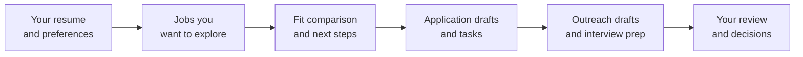

<div align="center">

# JobSSS

**Job Search Shape Send**

Your job search, organized with your AI agent.

Find roles that fit, prepare applications from your real experience,
and keep track of what comes next — in a workspace on your machine.

[Get started](#get-started) · [What you get](#what-you-get) · [How it works](#how-it-works) · [Architecture](#architecture)

</div>

## What you get

| In your search | JobSSS helps you |
| --- | --- |
| **Know your strengths** | Build a profile from your resume and collect experience to support your applications. |
| **Choose where to apply** | Import job descriptions or public job links, compare fit, and see the reasons behind each score. |
| **Prepare your application** | Draft tailored resumes, cover letters, and answers using your own experience. |
| **Keep things moving** | Organize roles, application preparation, tasks, and your review queue in one place. |
| **Plan your outreach** | Map your contacts and draft messages for you to review and send. |
| **Get ready for interviews** | Prepare STAR stories, practice questions, and identify gaps. |

JobSSS is a plugin for an AI agent. Your agent handles the conversation;
JobSSS keeps the job-search records and documents. The core workflow needs no
API key. Your agent host has its own model and account requirements.

## Get started

You need **Node.js 22 or newer** and an agent host. Run these commands in the
terminal where you use that host; if you use it in WSL, use your WSL terminal.

### Run with npx

```bash
npx --package=github:lpbangun/jobsss jobsss init
```

### Or install the CLI globally

```bash
npm install -g github:lpbangun/jobsss
jobsss init
```

These commands fetch the CLI from GitHub and need Git as well as Node.js.
They become available when this packaging change is published to the repository.
`init` creates `jobsss-workspace/` in your current folder, including a local
runtime, personal data folder, and project configuration for Codex and Claude
Code. Choose a custom folder with `jobsss init my-job-search`. You can use a
new folder or an existing empty folder; its personal data stays inside
`.jobsss/data/` within that workspace.

```bash
cd jobsss-workspace
node jobsss.mjs doctor
codex  # or claude
```

Review your agent's trust prompts and start a fresh chat. This workspace includes
the core JobSSS plugin. For the optional companion stack, use the separate
installation below; its host-managed data folder is separate from this workspace.

### Codex: load the job-search stack

```bash
git clone https://github.com/lpbangun/jobsss.git
cd jobsss
codex plugin marketplace add .
codex plugin add job-search-stack@jobsss-local
```

Start a **new Codex chat** after installation so the plugin loads. The included
stack contains JobSSS, people-finder, and contact-brief. JobSSS works on its own;
the companions add candidate-lead discovery and contact briefs.

This integration has been verified on Windows. See the
[installation guide](INSTALL.md) for other hosts, activation checks, and source
setup, including a local install before the GitHub update is published.

### Start with one job

Give your agent your resume and a job description, then try:

> Use JobSSS to create my profile from this resume. Compare this job with my
> experience and preferences, explain the fit, and suggest what I should do next.

Then continue with:

- “Prepare a tailored resume and cover letter for this role.”
- “Show my pipeline and the tasks I should work on next.”
- “Draft an outreach message for me to review.”
- “Help me prepare interview stories for this role.”

Review the drafts before using them. Resume PDF export needs a local Chrome or
Edge browser available to the runtime; the installation guide covers setup.

## How it works


```mermaid
flowchart LR
  P["Your resume<br/>and preferences"] --> J["Jobs you<br/>want to explore"]
  J --> F["Fit comparison<br/>and next steps"]
  F --> A["Application drafts<br/>and tasks"]
  A --> N["Outreach drafts<br/>and interview prep"]
  N --> R["Your review<br/>and decisions"]
```

Your profile, jobs, documents, and tasks stay in the plugin's local data
folder and remain available when you restart. Optional public job intake uses
the network. Information shared in chat follows your agent host's and model
provider's data policies.

JobSSS drafts materials and messages. **You review, send, and submit.**
Resume proof points and interview stories need your verification. Local
review decisions use the trusted human CLI described in the
[technical reference](TECHNICAL.md#human-only-authority).

## Architecture

The full architecture flow is preserved below, including the agent host,
bundled runtime, local storage, human decisions, and optional companions.

<p align="center">
  
</p>

The agent calls JobSSS tools; the bundled runtime manages the local workspace.
The host provides the data folder (`PLUGIN_DATA`), and human decisions stay on a
separate local CLI. Companions pass results through the host and cannot write
JobSSS state directly.

[Architecture details](TECHNICAL.md#architecture) ·
[Diagram source](docs/jobsss-architecture.mmd) ·
[Tool reference](TECHNICAL.md#mcp-tool-reference-57-tools)

## Learn more

| Guide | What's inside |
| --- | --- |
| [Installation](INSTALL.md) | Host setup, requirements, and activation checks. |
| [Technical reference](TECHNICAL.md) | Detailed features, tool contracts, local data, architecture boundaries, and release evidence. |
| [Client compatibility](compat/README.md) | Integration status and host-specific details. |
| [Contributing](AGENTS.md) | Repository conventions and required checks. |

JobSSS is an early release (`0.1.0`). Core job-search workflows are implemented;
host and standalone-platform verification varies. See
[status and limitations](TECHNICAL.md#status-and-limitations) before choosing a
setup.

## License

[MIT](LICENSE). Design attribution is in [NOTICE](NOTICE).
