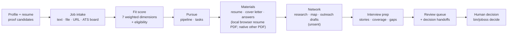

# JobSSS technical reference

For features and setup, start with the [README](README.md) and [installation guide](INSTALL.md).

## Architecture

<p align="center">
  
</p>

Diagram source: [`docs/jobsss-architecture.mmd`](docs/jobsss-architecture.mmd),
rendered with `npx @mermaid-js/mermaid-cli` (dark theme, `#0f172a` background).
The two companion plugins are drawn as separate, optional components the host may
install alongside JobSSS.

Six boundaries carry the whole design:

1. **The host never touches state.** It reads the skill and calls tools; the MCP
   layer validates JSON-RPC envelopes before dispatch, so the agent cannot reach
   past the tool contract.
2. **The plugin is self-contained.** One launcher, one MCP server, one domain
   layer. It resolves nothing from outside itself — no other project, no service.
3. **`PLUGIN_DATA` is the only state root.** Durable state, exports, and the audit
   trail live there; the plugin directory stays read-only and portable.
4. **Network access is one narrow pipe.** Bounded, public-address-only intake of
   job pages and public ATS boards. Everything else is blocked.
5. **Human authority never travels through MCP.** `list_decision_handoffs` and
   `create_decision_handoff` create non-authoritative markers only; a human
   completes the decision on `./bin/jobsss decide`.
6. **Companions are separate plugins, not internals.** [people-finder](https://github.com/lpbangun/people-finder)
   and [contact-brief](https://github.com/lpbangun/contact-brief) are optional
   plugins installed from the same pack. They own candidate discovery and contact
   evidence; their output reaches JobSSS only as host-supplied input to
   `record_contact_discovery` / `prepare_applications_batch`. The dependency never
   runs the other way, neither companion can write JobSSS state, and removing them
   leaves the core journey intact.

### What it does, end to end



## Features

### Local-first core

| Feature | What you get |
| --- | --- |
| **Zero npm runtime dependencies** | Node 22+ standard library only. Core offline operations need no browser or system converter. Resume PDF export has a declared local Chrome/Edge prerequisite; other PDF output uses the native renderer. |
| **Offline by default** | The entire core journey (doctor → start → profile → intake → score → pursue → pipeline → review) runs with no network, no API key, and no provider. Network is used only for optional public intake. |
| **One data root** | All durable state lives under `PLUGIN_DATA`. Nothing is written into the plugin directory, and no user state leaks into the repository. |
| **Restart-safe** | Versioned store with lossless migration from the legacy `store.json`, plus read-only restart readbacks (`get_resume`, `get_score`, `get_interview_prep`). |
| **Readable state** | Canonical `store.json` plus JSON and Markdown mirrors in the default full mode. A new workspace can opt into compact mode to keep only canonical state and requested document exports; tool readbacks still work. |

### Profile, resume and proof

| Feature | What you get |
| --- | --- |
| **Profile creation + import** | `create_profile` takes a name plus inline resume text or a staged file under `PLUGIN_DATA`. |
| **Proof-point extraction** | Resume imports extract proof *candidates* with metrics, always flagged for human verification. Retrying an identical proof keeps the original record and its verification; changed summary/skills/metrics create a separate unverified proof while preserving prior evidence. |
| **Structured resume revisions** | Versioned resume revisions per profile, inspectable via `list_resumes`, read back in full via `get_resume`. |
| **Preference control** | `update_profile` changes preferences (target role families, skills, compensation floor, location/work model, mission) — a real preference revision flows into tailored output instead of being a formatting no-op. |
| **Identity safety** | Reimports resolve a unique exact current name (including after rename); conflicting renames and ambiguous imports are rejected rather than merged. |

### Job intake and discovery

| Feature | What you get |
| --- | --- |
| **Three intake paths** | Inline `text`/`content`, a staged path under `PLUGIN_DATA`, or a public `http(s)` URL. Arbitrary absolute filesystem paths are rejected (`unsafe_intake_path`). |
| **Public URL hardening** | `import_job_url` rejects `file:`, credentialed URLs, private/loopback/link-local hosts, single-label names, unsafe redirects, oversized and failed responses with typed errors. |
| **Public ATS intake** | Greenhouse boards by `boardToken`: listing + detail payloads, application questions with option sets, required document kinds, and raw provenance. |
| **Offline discovery path** | Staged search fixtures under `PLUGIN_DATA` run the same discovery flow with no network, so discovery is testable and reproducible. |
| **Deduplication** | Re-importing the same posting deduplicates to a single job id; saved searches dedupe on effective identity (including the real `minFit` floor). |
| **Triage** | `save_job`, `skip_job`, `archive_job`, `list_jobs`. Unsaved discoveries stay database-only and create no application folder. |
| **Fault isolation** | `daily_discovery` runs each saved search independently and reports per-search errors instead of aborting the whole run. |

### Fit scoring (deterministic, no model)

`score_job` implements the stable `jobsss.fit-score.v1` contract with all seven
weighted dimensions, evidence references, reasons, contradiction handling, and
fail-closed eligibility:

| Dimension | Weight |
| --- | --- |
| `roleFit` | 28 |
| `domainFit` | 18 |
| `seniority` | 14 |
| `missionInterest` | 14 |
| `locationWorkModel` | 12 |
| `compensation` | 8 |
| `networkAccess` | 6 |

Rules that matter when you shortlist: a dimension with missing evidence reports
`unknown` rather than a guessed score; hard eligibility failures are disclosed, so
an excluded role is never presented as an actionable high-fit recommendation;
missing pay or authorization evidence is not permission to assume eligibility;
and no exchange rate, bonus, or equity is ever invented to satisfy a base-pay
floor.

### Materials and answers

| Feature | What you get |
| --- | --- |
| **Tailored resume** | `tailor_resume` routes normalized, labelled, and ordinary Markdown profiles through one canonical document. `revise_resume` takes explicit claim IDs to suppress or prefer source-backed bullets and creates a separate draft. Legacy sources are migrated to a source-linked draft; the original resume stays in `PLUGIN_DATA`, and inferred original-line matches are marked as legacy projections for human review. Candidate identity, role/project ownership, selected achievements, and direct/adjacent/unsupported/unknown requirement coverage are inspectable. `contactEmail` chooses the application address; `locationNote` adds an explicitly verified relocation phrase. |
| **Cover letter** | `inspect_cover_letter_brief` gathers active proof, job requirements, recorded employer context, and candidate voice preferences. `draft_cover_letter` uses a natural first-person voice tailored to the role and employer, separates established accomplishments from a clearly framed future contribution, and never turns requirements into claimed experience. Optional voice samples guide style only, never facts. Export as editable DOCX or PDF. `revise_cover_letter` saves reviewed edits as separate revisions, preserved when materials are regenerated. |
| **Resume PDF export and designs** | `list_resume_designs` exposes Navy Professional, Editorial Serif, and Quick Scan. Choose `style: "navy"`, `"editorial"`, or `"scan"` with `render_resume` or `tailor_resume`; `compare_resume_designs` generates all three from one canonical content revision, `list_resume_design_variants` reads them back, and `select_resume_design` stores the user's local preference. Selection does not attest that a resume was used or submitted. Each design has a separate PDF artifact and visual review. An installed Chrome or Edge prints local HTML; `doctor.resumeRenderer` reports detection, and a missing browser fails with `resume_renderer_unavailable`. Browser layout is measured at Letter printable width before printing; the PDF must be one searchable Letter page. `inspect_resume_qa` reads the stored result. Trusted visual review and content approval are separate decisions; approval blocks missing PDF QA or unverified cited proof points. No employer site is opened. |
| **Other PDF export** | Cover letters and other materials retain the dependency-free native PDF renderer. Its Letter pages use 44pt margins and paginate long sources. |
| **Reusable answers** | `save_answer` stores drafts from exact proof wording with explicit `sensitivity` (`public \| personal \| sensitive \| restricted`) and `reuseScope` (`global \| employer_specific \| never_auto_fill`). Invalid values are rejected with typed errors. No auto-fill, no send. |
| **Grounding, always** | Canonical claims carry source quotes, owner IDs, and original line pointers. Imported proof IDs and verification status are attached where available; inferred legacy pointers are explicitly marked for review. Successive truthful revisions are kept separately. |

### Pipeline, network, interviews

| Feature | What you get |
| --- | --- |
| **Pursuit and readiness** | `pursue_job`, `applications_plan`, persistent tasks (`list_tasks`, `update_task`), and a draft readiness artifact for review. |
| **Submission is not attestable** | `update_application_status` rejects `applied`/`submitted` — MCP cannot attest submission. |
| **Contacts and research** | `import_contact` accepts a plain contact card/text or the documented `contact-brief.v1` JSON (subject identity plus the attribution-labelled provider-reported address) from inline input or a `PLUGIN_DATA`-staged path; records stay `humanApproved: false` with the mailbox `not_checked`, and a repeat or address-less re-import reconciles onto the existing logical contact instead of duplicating it; an address-bearing re-import also reconciles the leftover address-less machine duplicate an older release could leave beside it, keeping that record's id and source metadata in the survivor's history. `record_research`, `list_contacts`, `list_research` preserve relationship and source notes. Same-name people at different companies are never merged; human-approved, suppressed, do-not-use and conflicting-address records are never collapsed; a profile URL is not treated as a messaging channel. |
| **Network mapping** | `map_reachable_network` distinguishes cold professional email access, weak acquaintance, and channel-pending stakeholders. |
| **Outreach drafts** | `plan_outreach`, `draft_outreach`, `list_outreach`. Every draft is `delivered: false`; recipient-facing subject/body stay separate from internal notes. |
| **Interview prep** | `draft_interview_story`, `list_interview_stories`, `interview_prep`, `get_interview_prep`, `interview_debrief_handoff`. Stories stay `draft_needs_verification`; the debrief handoff attests nothing. |
| **Freshness, not approval** | Stored prep readbacks, drafts, and handoffs carry computed `freshness: {status: current\|stale, reasons: []}` — evidence currency only. Nothing is deleted or auto-regenerated. |
| **Sync preview** | `preview_sync` produces a secret-safe dry-run export preview and transmits nothing. |

### Authority and safety

| Feature | What you get |
| --- | --- |
| **Human-only decisions** | 12 decision actions complete **only** on the trusted local CLI `./bin/jobsss decide`, bound to exact `id` + `revision` + `contentHash`. Stale bindings persist nothing. |
| **Non-authoritative handoffs** | MCP can only `list_decision_handoffs` and `create_decision_handoff` — a request marker that grants no authority. |
| **Frozen blocked catalog** | A 25-name human-only catalog (`approve_artifact`, `mark_outreach_sent`, `attest_application_submitted`, `submit_application_form`, `assist_application_form`, …) must never appear on `tools/list`. Verified absent. |
| **Honest transport** | JSON-RPC 2.0 envelopes are validated before notification classification; omitted arguments default to `{}`; explicit `null` rejects with `-32602`; invalid envelopes return `-32600`; business failures stay tool results with `isError: true`. |
| **Portable contracts** | `contracts/` defines host-neutral packet, outcome, and bulk-input schemas with stable error codes (`fabricated_readiness`, `remote_attestation`, `non_public_host`, `secret_like_field`, …). Validation is pure and offline; it grants no authority. |

## The journey

| Route | MCP tool | Result |
| --- | --- | --- |
| `/jobsss doctor` | `doctor` | Diagnose the launcher and `PLUGIN_DATA` readability/writability. |
| `/jobsss start` | `start` | Initialize (or migrate) durable state under `PLUGIN_DATA`. |
| `/jobsss profile` | `create_profile` | Create or import a profile, extract proof candidates. |
| `/jobsss find` | `import_job`, `list_jobs` | Import and list jobs (deduplicated). |
| `/jobsss score` | `score_job` | Deterministic seven-dimension fit + eligibility. |
| `/jobsss pursue` | `pursue_job` | Record pursuit, prepare review-ready artifacts. |
| `/jobsss pipeline` | `applications_plan` | Local pipeline/readiness and next actions. |
| `/jobsss review` | `review_queue`, `list_decision_handoffs` | Review state + pending human decisions, then hand off to `./bin/jobsss decide`. |

## MCP tool reference (57 tools)

<details open>
<summary><b>Diagnostics and state</b> (2)</summary>

`doctor`, `start`
</details>

<details>
<summary><b>Profile, resume and proof</b> (8)</summary>

`create_profile`, `list_profiles`, `update_profile`, `archive_profile`,
`restore_profile`, `add_proof_point`,
`list_resumes`, `get_resume`
</details>

<details>
<summary><b>Job intake</b> (3)</summary>

`import_job`, `import_job_url`, `list_jobs`
</details>

<details>
<summary><b>Discovery and triage</b> (7)</summary>

`create_saved_search`, `list_saved_searches`, `search_jobs`, `daily_discovery`,
`save_job`, `skip_job`, `archive_job`
</details>

<details>
<summary><b>Scoring</b> (2)</summary>

`score_job`, `get_score`
</details>

<details>
<summary><b>Lifecycle and tasks</b> (5)</summary>

`pursue_job`, `applications_plan`, `update_application_status`, `list_tasks`,
`update_task`
</details>

<details>
<summary><b>Materials and answers</b> (15)</summary>

`inspect_resume_requirements`, `tailor_resume`, `revise_resume`, `render_resume`,
`inspect_resume_qa`, `list_resume_designs`, `compare_resume_designs`,
`list_resume_design_variants`, `select_resume_design`,
`inspect_cover_letter_brief`, `draft_cover_letter`, `revise_cover_letter`,
`save_answer`, `list_answers`, `match_answers`
</details>

<details>
<summary><b>Review and handoffs</b> (3)</summary>

`review_queue`, `list_decision_handoffs`, `create_decision_handoff`
</details>

<details>
<summary><b>Contacts, research and network</b> (8)</summary>

`import_contact`, `list_contacts`, `record_research`, `list_research`,
`map_reachable_network`, `plan_outreach`, `draft_outreach`, `list_outreach`
</details>

<details>
<summary><b>Interview prep</b> (5)</summary>

`draft_interview_story`, `list_interview_stories`, `interview_prep`,
`get_interview_prep`, `interview_debrief_handoff`
</details>

<details>
<summary><b>Export</b> (1)</summary>

`preview_sync`
</details>

<details>
<summary><b>Bounded preparation and contact evidence</b> (4)</summary>

`prepare_applications_batch`, `record_contact_discovery`,
`list_preparation_batches`, `list_contact_discoveries`
</details>

`53` is the entire advertised surface: `tools/list` is audited to contain no
hidden or extra names, and no blocked name may appear there.

## Human-only authority

```bash
./bin/jobsss decide --data "$PLUGIN_DATA" --list
./bin/jobsss decide --data "$PLUGIN_DATA" \
  --action artifact.review_visual --id <id> --revision <n> --content-hash <sha256>
./bin/jobsss decide --data "$PLUGIN_DATA" --list
./bin/jobsss decide --data "$PLUGIN_DATA" \
  --action artifact.approve --id <id> --revision <n> --content-hash <sha256>
```

Thirteen actions exist, and only a human on this CLI can complete them:

`proof.verify` · `artifact.review_visual` · `artifact.approve` · `artifact.reject` · `contact.approve` ·
`contact.suppress` · `story.verify` · `story.retire` · `debrief.record` ·
`debrief.correct` · `outreach.sent` · `outreach.outcome` ·
`application.observe_status`

An externally observed application status is a **human observation** recorded
here and attributed to the human — never to JobSSS.

## Local data

`PLUGIN_DATA` after `start`:

```text
PLUGIN_DATA/
├── store.json                      canonical, versioned state (schemaVersion 2)
├── projections/
│   ├── profiles.json   proof-points.json   jobs.json   searches.json
│   ├── applications.json   review.json   tasks.json   contacts.json
│   ├── network.json   interviews.json   state.json
│   └── audit.md                    human/agent-readable audit trail
└── … job, document and profile payloads (including exported PDFs)
```

This is the default **full** mode. To choose a smaller layout for a new data
directory, run `./bin/jobsss start --data <dir> --compact` or call the MCP
`start` tool with `{ "outputMode": "compact" }`. Compact mode automatically
writes only `store.json` until a document is explicitly exported. User-staged
intake files, if any, remain the user's files. It keeps profiles, jobs,
searches, evidence, decisions, and audit history in that canonical store; the
normal readback tools remain available. It omits automatic JSON and Markdown
mirrors, including `application.md` packet links in batch results. Text and
Markdown drafts remain available as tool responses when no resume PDF renderer
is installed. A compact workspace retains its mode on restart; changing the
mode of an existing workspace requires a separate migration.

Cover letters default to editable DOCX in compact mode; full mode keeps its
Markdown default. `draft_cover_letter` also accepts `format: "docx"` explicitly,
and Markdown, text, and PDF formats remain available. Exported
DOCX files, like PDFs, use content-addressed names so a reviewed version is
not silently overwritten.

- Durable state is created and migrated on `start`; a legacy `store.json`
  migrates losslessly with ids preserved and an audit trail.
- Projections are read-only mirrors — the store stays canonical.
- Secrets are never required for the core journey and sync preview is
  secret-safe by design.
- Removing `PLUGIN_DATA` removes the workspace; nothing exists outside it.

## Standalone releases

```bash
./bin/jobsss release --out /abs/out --target current-host
```

The release bundles the runtime into a single native executable with the pinned
Node SEA injector (`postject`, exact version/URL/SHA-256 in
`src/packaging.lock.json`), so **no Node and no other runtime need to exist on
`PATH` at runtime**. Repeated clean builds for a target are byte-identical.

| Target | Status | Meaning |
| --- | --- | --- |
| `linux-x64` | **verified** | Built from the checksum-pinned official Node v22.22.3 executable and exercised through stdio MCP under a restricted `PATH`. |
| `current-host` | **built** | Built and exercised on the build host. |
| `linux-arm64`, `darwin-x64`, `darwin-arm64`, `win-x64` | **unverified** | Structural validation over genuine official inputs only; unproven until exercised on a real matching host. |

Honesty rules baked into the pipeline: only the checksum-pinned official Node
executable is accepted as an input (`--node-binary`); a target is labeled
`verified` **only** after real execution on a matching host; cross-built artifacts
stay `unverified` forever until proven. Signed `node.exe` is staged unsigned (the
Security certificate directory is zeroed in a private copy), so the Windows
artifact must be re-signed on a matching Windows host. Full evidence lives in
`evidence/native-validation.json` and is reproduced with:

```bash
JOBSSS_NATIVE_CACHE="$(mktemp -d)" ./bin/jobsss evidence --out "$(pwd)/evidence/native-validation.json"
```

## Client compatibility

| Client | Plugin/MCP loading | Status |
| --- | --- | --- |
| Hermes | native stdio MCP | **verified** (isolated temporary `HERMES_HOME` launch discovered the tools) |
| Claude Code | native stdio MCP | **verified** (isolated `CLAUDE_CONFIG_DIR` launch reported the server `Connected`) |
| Codex | generated aggregate plugin (`codex-pack/job-search-stack`) | **verified** on Windows (fresh install, explicit and natural activation, MCP initialize, and state-changing workflow) |
| Pi | native skills | unverified |
| Oh My Pi (`omp`) | — | unverified |

Client version strings in `compat/matrix.json` are availability observations, not
integration proof. MCP registration alone never counts as verified: only a real
isolated launch that loaded the skill and exchanged a state-changing call does.
See [compat/README.md](compat/README.md).

## Verification and acceptance

`BENCHMARK.md` is the **frozen pass bar** and is reviewer-owned. Verdict is
`pass` or `fail`: no score, no partial credit, and a check may never be deleted,
rewritten, or weakened to look green. It defines gates `B1`–`B70` across the
standalone launch contract, live journey proofs, productization/determinism,
cross-platform remediation, native packaging safety, provenance, and release
evidence.

```bash
node --test --test-concurrency=1 tests/jobsss-gate0.test.mjs \
  tests/jobsss-mcp-compat.test.mjs tests/jobsss-journey.test.mjs \
  tests/jobsss-persistence.test.mjs tests/jobsss-discovery.test.mjs \
  tests/jobsss-workflows.test.mjs tests/jobsss-integrity.test.mjs \
  tests/jobsss-release.test.mjs tests/jobsss-adapters.test.mjs \
  tests/jobsss-authority.test.mjs tests/jobsss-cross-platform.test.mjs
```

Scoped regression files (`tests/*-regression.test.mjs`) pin each repaired defect
class: intake identity, resume roles, scoring pay evidence, profile proofs,
discovery robustness, consistency, Greenhouse promotion, and P3 contracts.

**How to read a red run.** The release and native-evidence gates need the
checksum-pinned official Node v22.22.3 executable plus `python3`. On a machine
whose `node` is not that exact binary, `release`/`evidence` fail **closed** with
`refusing to build from an unpinned base` (gates `B30`, `B31`, `B32`, `B54`,
`B65`) — failing closed is the design: the pipeline will not emit an artifact it
cannot verify. Gate `B67` additionally requires
`evidence/native-validation.json` to be regenerated with

```bash
JOBSSS_NATIVE_CACHE="$(mktemp -d)" ./bin/jobsss evidence --out "$(pwd)/evidence/native-validation.json"
```

whenever runtime bytes change; a stale artifact fails the byte-identity check
rather than being silently accepted. Run the suite on a host carrying the pinned
input for a full green bar.

**Verification history.** A local, independently blind-judged evaluation of three
end-to-end journey lanes (PM, SWE, ML profiles, synthetic data) against commit
`546913c` returned `PASS` on all seven judging criteria per lane — journey
completion with zero host rescues, artifact-set parity, PDF text-layer integrity,
grounding (zero untraced claims), networking honesty, interview prep, and scoring
honesty. The lane artifacts and judge verdict live under the gitignored `.tmp/`
tree, so they are reproducibility notes rather than committed evidence. The
committed evidence is the frozen pass bar plus the acceptance suite.

## Design invariants

1. **Standalone.** One skill, one MCP server, one bundled runtime. Nothing is
   resolved from, imported from, or spawned out of another project.
2. **State isolation.** Durable state lives only under `PLUGIN_DATA`; the plugin
   directory stays read-only and portable.
3. **No fabricated success.** Never claim a send, submission, approval, applied
   attestation, or deferred capability. Only report what actually happened.
4. **Grounding.** Generated claims trace to owned proof or cited public sources.
   Nothing is invented, and metrics are never embellished.
5. **Human authority stays human.** Approval, verification, sending, and observed
   external status are completed by a human on the trusted CLI and attributed to
   the human.
6. **Thin hosts.** Client adapters are pointers, never a second source of truth.
7. **Labeled truth.** Verified means proven by real execution; everything else is
   labeled `unverified`, and weak checks are never weakened to pass.

## Repository layout

```text
plugin.json              Agent Plugins 1.0.0 manifest (name, version, license)
mcp.json                 stdio MCP server declaration (single runtime entry)
skills/jobsss/           the skill: SKILL.md + references/
  references/standalone-journey.md    journey, argument shapes, blocked catalog
  references/human-only-handoffs.md   frozen human-only decision catalog
  references/client-compatibility.md  per-client loading and verification rules
bin/jobsss               bundled launcher (source + release builds)
src/                     bundled runtime (mcp, domain, workflows, scoring, …)
contracts/               portable packet / outcome / bulk-input schemas + examples
compat/                  thin client adapters and the compatibility matrix
docs/                    architecture diagram (.mmd source + rendered .svg)
tests/                   reviewer-owned acceptance suite + synthetic fixtures
synthetic fixture data     synthetic postings, resumes, boards, contact cards
BENCHMARK.md             frozen pass bar (B1–B70)
evidence/                canonical native-format validation evidence
AGENTS.md                contributor invariants and commands
```

## Cite JobSSS

When you reference JobSSS, cite the **version and the commit** you actually ran —
the safety contract and tool surface are versioned artifacts, and behavior is
reproducible per commit.

```bibtex
@software{jobsss,
  title        = {JobSSS: a standalone Agent Plugin for local, evidence-grounded job-search workflows},
  author       = {{JobSSS contributors}},
  year         = {2026},
  version      = {0.1.1},
  license      = {MIT},
  url          = {https://github.com/lpbangun/jobsss},
  note         = {Agent Plugins 1.0.0; 57 local MCP tools; frozen pass bar B1-B70; release v0.1.1}
}
```

Plain text:

> JobSSS contributors. *JobSSS: a standalone Agent Plugin for local,
> evidence-grounded job-search workflows.* v0.1.1, MIT, 2026.
> Agent Plugins 1.0.0. Release `v0.1.1`.

Reproducing a claim: quote the commit, the tool name, the arguments, and the
persisted readback (tool output or a file under `PLUGIN_DATA`). Anything a human
completed belongs to the human and is recorded with `actor: trusted_local`.

## Status and limitations

- Pre-release `0.1.1`. The deterministic offline core, discovery/intake, scoring,
  browser-rendered resume PDFs and native other-material PDFs, networking drafts, interview prep, review/authority
  split, persistence, and packaging are implemented and under a frozen,
  reviewer-owned acceptance bar.
- `linux-x64` standalone is verified; `linux-arm64`, `darwin-x64`,
  `darwin-arm64`, and `win-x64` are structurally validated but unverified until
  executed on matching hosts. Windows additionally needs re-signing on a Windows
  host.
- Hermes, Claude Code, and the generated Codex aggregate pack are verified on
  their recorded hosts; Pi and `omp` remain unverified.
- Searchable single-column PDF text is an ATS-readability proxy, not a
  proprietary ATS score or a guarantee.
- Public URL and ATS intake depend on third-party page/API shapes and can break
  independently; JobSSS reports those failures instead of pretending success.
  Users are responsible for complying with third-party platform terms.

## License

[MIT](LICENSE) © 2026 JobSSS contributors. Portions of the design derive from an
earlier MIT-licensed project; the attribution lives in [NOTICE](NOTICE).


## Install surface implementation notes

## Instructions for an agent asked to install this

1. Identify your host — Hermes, Codex, or neither.
2. **Hermes** — run the pack command above. Hermes shows a review screen (every
   plugin, source, and pinned ref), asks one confirmation for the pack, then runs
   its normal per-plugin install and capability consent. A pack never bulk-grants.
   That confirmation belongs to the human: show it, wait for it, never answer it
   automatically.
3. **Codex** — clone/download the tagged repository, add its root as the generated
   local marketplace, then
   install `job-search-stack@jobsss-local`. The aggregate is a deterministic
   host adapter over the exact reviewed products: JobSSS and people-finder are
   separate MCP servers and contact-brief remains a compiler skill. On Windows,
   the adapter launches extensionless JavaScript/Python products through thin
   Node shims; it does not fork product business logic. Verify a fresh task
   before reporting success. Start a new task after installation so Codex loads
   the new skills and MCP servers.
4. **Any other host** — use that host's own mechanism with the portable package at
   each repository root, or run the bundled launcher from a source checkout.
5. Report each plugin's activation state as **installed**, **enabled**, or
   **deferred until `mcp.reload` / the next session**. An enabled portable plugin
   whose MCP server is not visible until that point is not a failed install.
   Include the pinned commit and any per-plugin failure — a pack install can
   partially succeed. Enable-time capability grants are separate from a
   successful install.
6. Never weaken, skip, or pre-answer a host's consent step. JobSSS never sends,
   submits, approves, or attests anything, and no install changes that.

### Hermes: verify activation before starting a new session

Portable MCP server registration is session-scoped. Enabling a plugin can be
reported immediately, while its MCP server becomes active at `mcp.reload` or in
the next session. Before that reload, `hermes mcp list` may say `No MCP servers
configured.`; for a portable package this is expected, not evidence that the
install failed.

Before restarting, run `hermes plugins show jobsss` and verify `Status: enabled`.
Then start a new Hermes session and verify that the JobSSS MCP server/tools are
visible there. `hermes plugins doctor jobsss` may report
`registrations: 0 tool(s), 0 hook(s)` for a portable package; that counter is
normal and does not mean the portable MCP server failed to load.

Do not add a duplicate `jobsss` entry to Hermes `mcp_servers` configuration, and
do not hand-expand or rewrite the literal `${PLUGIN_ROOT}` / `${PLUGIN_DATA}`
placeholders in `mcp.json`. The portable loader resolves these placeholders when
loading the package and manages the plugin data location; a hand-wired duplicate
can collide with the plugin's own server registration.

### Runtime requirement: Node.js 22+ through PATH or `JOBSSS_NODE`

Both portable package roots declare Node.js `>=22` in `package.json`. The
metadata declarations do not guarantee that an installer enforces this requirement.
launcher needs a Node.js 22+ executable available to the Hermes service, either
as `node` or `nodejs` on its `PATH`, or through `JOBSSS_NODE` set to the absolute
path of a Node.js 22+ executable. An interactive shell's PATH change may not
reach a desktop or service process. The override selects an installed Node
runtime; it does not provide Node-free startup.

If neither source is available, the launcher reports:

```text
jobsss: Node.js 22 or newer is required, but this service could not find node or nodejs on PATH.
jobsss: Set JOBSSS_NODE to an executable Node.js 22+ binary, or add node (or nodejs) to the service PATH.
```

Set `JOBSSS_NODE` in the Hermes service environment or add `node`/`nodejs` to
that service's PATH. To inspect the PATH inherited by a running Hermes service,
read `/proc/<pid>/environ` (substitute the Hermes serve-process PID):

```bash
tr '\0' '\n' < /proc/<pid>/environ | grep -E '^(PATH|HOME|JOBSSS_NODE)='
```

Node-free startup of the portable package, such as shipping verified
per-platform SEA launchers, is a separate follow-up and is not provided by the
current launcher metadata or `JOBSSS_NODE` override.

## How these surfaces stay honest

`compat/install-pins.json` pins the reviewed trio to exact 40-character commits.
Every surface (`compat/hermes/find-people.pack.yaml` and the root Codex marketplace
`.agents/plugins/marketplace.json`)
is generated from that file by `scripts/build-install-surfaces.mjs`; `--check`
fails on drift and `--refresh` advances the pins deliberately. Surfaces carry no
authority and grant nothing. Every `compat/` surface remains metadata-only.
`scripts/build-codex-pack.mjs` mirrors the exact runtime/skill bytes into the
root-level generated package `codex-pack/job-search-stack` because the Codex
Windows host cannot execute the portable extensionless shebang launchers
directly. The repository root is the marketplace root, so the thin marketplace
can point to that sibling package without escaping its root. Its generated
`provenance.json` hashes every file and binds the package to the exact pins; it
is never a hand-maintained runtime fork.
