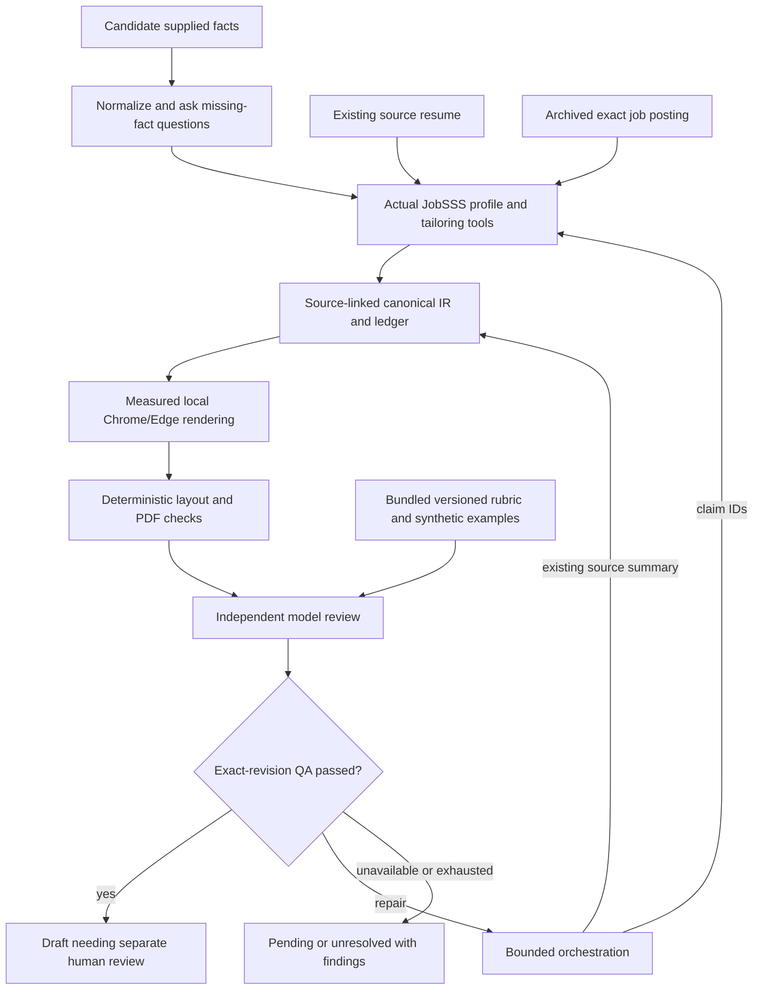

# Resume POCs: template QA and candidate setup

User scope: build both POCs on an isolated branch, independent review/testing,
reproducible E2E, and a live application-materials test for IXL job 8861477002.
No employer contact or submission is authorized or implemented.

Baseline `13063568fe5f1544728a794f4d8ab0025644943b` captures preexisting integration
work. Compare POC commits against it. The original checkout remains unchanged.

## Unix-style boundaries

The candidate fact source and the presentation benchmark are independent. A
personal master is optional; a comprehensive source need not fit on one page.
Bundled examples are fictional guidance, never evidence to copy into applicant
content. New candidates may supply notes, volunteer work or coursework.

The portable modules do not choose a model/provider. The Codex adapter requests
Luna Max; the host-agent adapter takes an attributed report. Each component
does one job, and the orchestrator owns retries and completion. The source
summary repair is verbatim and attributable, not a freeform model rewrite.

## What the experiment demonstrated

Actual MCP entry points exercised: tailor, revise, render and batch preparation.
Browser E2E validates one-page output and reproducible semantic IR/layout.
Independent tests check stale bindings, no-master intake, claim/summary hash
consistency, no-progress stops and preserved human authority.

The real IXL test exposed two useful issues. A generated occupational headline
overstated recruiting depth; the loop replaced it with the existing source
summary and re-reviewed. An earlier rubric also confused a missing job
qualification with a resume defect; v2 separates fit gaps from resume findings.
The final live model review passed after two attempts. See the sanitized
`experiments/resume-pocs/ixl-acceptance.json`; candidate documents and model
event logs are retained only in the user's private application dossier.

## Production handoff after POC review

Integrate the same quality/status gate into the canonical tool workflow,
including design comparisons and batch readiness. Do long model work outside
the store mutation lock; commit only after current source/artifact hash checks.
Provide durable jobs and clear host-capability handling so missing review
cannot be presented as completed. Preserve offline core operation: missing
model means pending independent QA, not fake review or a new API-key requirement.

Production renderers should adopt measured fitting/link handling rather than
maintaining the experimental renderer indefinitely. Package thin host adapters
against shared contracts. Any runtime-byte changes require refreshed pinned
native evidence; this POC changes no production `src/` or `bin/` bytes.

Reproducibility means archived inputs, fixed rubric/runtime/browser versions,
deterministic semantic/layout checks and attributed model runs. Neither model
wording nor browser PDF metadata is promised byte-identical. Fixture/replay
reviews are explicitly labeled and do not become live acceptance evidence.
